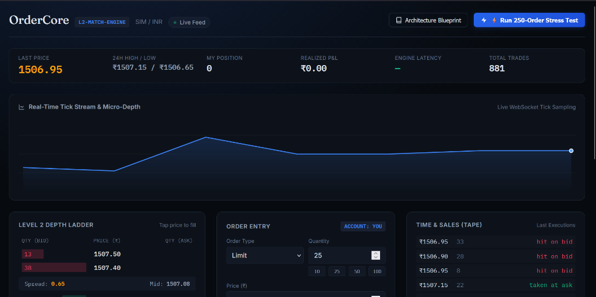

# OrderCore

[](https://ordercore.onrender.com)
[](tests/test_engine.py)
[](bench/benchmark.py)
[](LICENSE)

A limit order book and matching engine, with pre-trade risk checks, a live
WebSocket market data feed, and a trading terminal to place orders against it.

🌐 **Live Demo:** [https://ordercore.onrender.com](https://ordercore.onrender.com)



This is the piece of machinery that sits underneath every exchange and broker:
orders arrive, get validated, get matched against resting liquidity by strict
price–time priority, and become trades.


## Run it

```bash
git clone https://github.com/Gana-Y/OrderCore.git
cd OrderCore
python -m venv .venv && source .venv/bin/activate    # Windows: .venv\Scripts\activate
pip install -r requirements.txt
uvicorn api.main:app --reload
```

Open http://127.0.0.1:8000. Simulated market makers start quoting immediately,
so there is a live book to trade against. Click a price in the ladder to load it
into the ticket.

```bash
pytest -q                  # 18 tests covering matching and risk invariants
python bench/benchmark.py   # throughput and latency
```

## What it does

**Order types** — `LIMIT` rests on the book, `MARKET` sweeps it, `IOC` fills what
it can and cancels the rest, `FOK` fills entirely or not at all.

**Price–time priority** — better prices match first; at equal prices, whoever
arrived first is filled first. Trades print at the *resting* order's price, so a
buyer who bids ₹105 into a ₹100 offer pays ₹100. The maker was there first and
sets the terms.

**Pre-trade risk** — every order is checked before it reaches the book: tick-size
conformance, per-order value cap, position limit, and available funds. Rejected
orders come back with the reason, not a generic failure.

**Self-trade prevention** — if an account would match against its own resting
order, the resting side is cancelled and no trade prints.

**Live market data** — the book snapshot is pushed over a WebSocket to every
connected client on each change, which is how a real depth feed behaves.

## How it is built

```
ordercore/
  models.py     Order, Trade, Side, OrderType — money as integer paise
  book.py       the book: price levels, heaps, O(1) cancellation
  engine.py     risk checks, matching loop, position and cash settlement
  feed.py       synthetic market makers and noise traders
api/main.py     FastAPI: REST order entry, WebSocket feed
static/         the terminal — one HTML file, no build step
```

Three decisions worth calling out:

**Money is never a float.** All prices are integers in paise. `0.1 + 0.2 != 0.3`
is not a property you want in something that settles cash.

**Heaps of price levels, not a sorted list of orders.** Each side holds a dict of
`price -> FIFO queue` plus a heap of active prices. Best bid/ask is O(1)
amortised and inserting is O(log P) in the number of distinct *price levels*,
which is small and bounded by the tick grid — rather than O(log N) in the number
of orders, which is not.

**Cancellation is O(1), by flagging.** Real order flow is overwhelmingly cancels,
not fills. Removing an order from the middle of a queue is O(n); instead a cancel
marks the order dead and the queue discards dead orders lazily when it is next
walked. Each order is skipped at most once, so amortised cost stays constant.

## Numbers

200,000 orders through the engine on a single core, ~87% of them resulting in a
trade:

```
throughput   129,312 orders/sec
median       4.30 µs
p99         38.12 µs
```

The p99 tail is dominated by market orders that sweep several price levels at
once — those do proportionally more work, which is the expected shape.

## What is deliberately not here

No persistence, no authentication, and one symbol per engine instance. A real
venue needs a durable sequenced log so the book can be rebuilt after a crash, and
one engine process per symbol behind a partitioned gateway. The single-threaded
matching loop is the correct primitive to build both on — matching has to be
serialised anyway to keep priority meaningful.

## Licence

MIT
